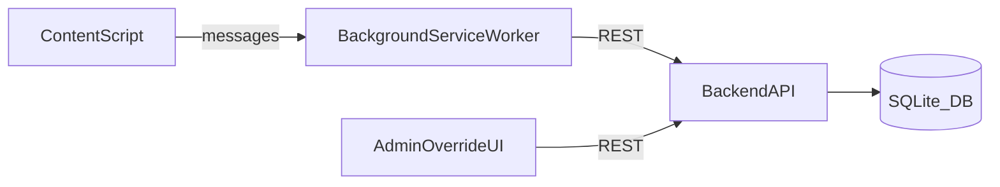

UI for the entire project should be inspired from this webpage UI - https://xrpl.org/docs

## System architecture (minimal, demo-ready)
- **Chrome Extension (Manifest V3)**
  - **Content script** (runs on `https://www.youtube.com/*`):
    - Detects YouTube player/video element, listens to play/pause/ended/timeupdate.
    - Injects an **in-page overlay UI** (Shadow DOM) with pricing + Start/Decline.
    - Maintains a lightweight session state (charging active, session_id, watched_seconds accumulator).
  - **Background service worker**:
    - Owns network I/O to backend (avoids CORS surprises; centralizes retries/batching).
    - Stores persistent `install_id` (anonymous user id) in `chrome.storage.local`.
    - Optional: global toggle (enable/disable StreamPay).
- **Backend API** (pick one stack; both are fast)
  - **Option A (recommended for speed): Node.js + Express (TypeScript)**
  - **Option B: Python + FastAPI**
  - Responsibilities:
    - Price computation endpoint (base + current per-minute).
    - Session creation + event ingestion + session finalization.
    - Admin override endpoints + tiny admin page (optional) for live demo.
- **Database**
  - **SQLite** for hackathon local/demo (file-based, no infra).
  - Schema designed so you can swap to Postgres later with minimal changes.

Mermaid overview:



## YouTube event detection (practical approach)
- **Video id extraction** (no API key):
  - Standard watch pages: `new URL(location.href).searchParams.get('v')`.
  - Short links: parse pathname when host is `youtu.be` (optional).
  - Ignore/skip `youtube.com/shorts/*` for MVP unless you want to support it explicitly.
- **Find the `<video>` element**:
  - Query `document.querySelector('video')` but don’t assume it’s stable.
  - Use a `MutationObserver` to re-bind listeners when YouTube replaces the player on SPA navigation.
  - Also listen for `window.addEventListener('yt-navigate-finish', ...)` (YouTube SPA event) and/or poll for URL changes.
- **Detect play/pause reliably**:
  - Attach listeners on the actual video element:
    - `play`, `pause`, `ended`, `timeupdate`.
  - On first `play` **before consent**:
    - Immediately `video.pause()` and render overlay.
    - (Gotcha) YouTube may auto-play ads; detect ad mode via DOM signals and skip gating during ads.

## Data model schema (videos + watch sessions)
Keep it simple but extensible.

### `videos`
- `id` (uuid or int pk)
- `youtube_video_id` (string, unique, indexed)
- `title` (string, nullable)
- `length_seconds` (int)
- `base_price_cents` (int) — creator-set flat full-video price
- `manual_override_enabled` (bool, default false)
- `manual_avg_watch_ratio` (real, nullable) — 0..1
- `created_at`, `updated_at`

### `watch_sessions`
- `id` (uuid pk)
- `youtube_video_id` (string, indexed) OR fk to `videos.id`
- `install_id` (string, indexed) — anonymous per-extension install
- `started_at` (datetime)
- `ended_at` (datetime, nullable)
- `video_length_seconds` (int snapshot)
- `watched_seconds_total` (int, default 0)
- `watch_ratio` (real, nullable) — computed on finalize
- `status` (enum: `active|ended|abandoned`)

### `watch_events` (optional but great for demo observability)
- `id` (uuid pk)
- `session_id` (fk, indexed)
- `type` (enum: `start|pause|resume|heartbeat|end|decline`)
- `ts` (datetime)
- `playhead_seconds` (real, nullable)
- `delta_watched_seconds` (int, nullable)
- `meta_json` (json, nullable)

## REST endpoints (with payload examples)
All requests include:
- `X-Install-Id: <uuid>` header (generated client-side once)

### Pricing / video metadata
- **GET** `/api/videos/:youtubeId/price`
  - Response:
    ```json
    {
      "youtube_video_id": "dQw4w9WgXcQ",
      "length_seconds": 213,
      "base_price_cents": 599,
      "avg_watch_ratio": 0.62,
      "override": {"enabled": true, "manual_avg_watch_ratio": 0.62},
      "pricing": {
        "r_target": 0.5,
        "k": 1.0,
        "total_price_cents": 671,
        "per_minute_cents": 189
      }
    }
    ```

### Session lifecycle
- **POST** `/api/sessions`
  - Body:
    ```json
    {
      "youtube_video_id": "dQw4w9WgXcQ",
      "video_length_seconds": 213,
      "base_price_cents": 599
    }
    ```
  - Response:
    ```json
    {"session_id":"b3c1...","status":"active"}
    ```

- **POST** `/api/sessions/:sessionId/events`
  - Body examples:
    - start:
      ```json
      {"type":"start","ts":1730000000,"playhead_seconds":0}
      ```
    - pause:
      ```json
      {"type":"pause","ts":1730000030,"playhead_seconds":12.4}
      ```
    - resume:
      ```json
      {"type":"resume","ts":1730000040,"playhead_seconds":12.4}
      ```
    - heartbeat (batched delta):
      ```json
      {"type":"heartbeat","ts":1730000050,"playhead_seconds":22.4,"delta_watched_seconds":10}
      ```

- **POST** `/api/sessions/:sessionId/end`
  - Body:
    ```json
    {"ts":1730000123,"playhead_seconds":120.0,"watched_seconds_total":118}
    ```
  - Response:
    ```json
    {"status":"ended","watch_ratio":0.55}
    ```

### Admin override (for demo)
Secure lightly with a shared token `X-Admin-Token` for hackathon.
- **PUT** `/api/admin/videos/:youtubeId/override`
  - Body:
    ```json
    {"manual_override_enabled": true, "manual_avg_watch_ratio": 0.1}
    ```
- **PUT** `/api/admin/videos/:youtubeId/override/disable`

Optional: **GET** `/admin` simple page to set override and see computed pricing live.

## Extension UI flow (overlay) + metering/session logging pseudocode
### UI states
- **Idle**: no session, user hasn’t declined.
- **GateShown**: overlay visible, video paused.
- **ChargingActive**: session active, subtle badge “Charging active” + live cost estimate.

### Content script pseudocode
```js
state = {
  installId,
  videoEl: null,
  youtubeId: null,
  gatingShown: false,
  declinedForVideo: false,
  sessionId: null,
  charging: false,
  watchedSecondsAcc: 0,
  lastTickTs: null,
  heartbeatEverySec: 10
}

function bindVideo(videoEl) {
  unbindPrevious();
  state.videoEl = videoEl;

  videoEl.addEventListener('play', onPlay, true);
  videoEl.addEventListener('pause', onPause, true);
  videoEl.addEventListener('ended', onEnded, true);
}

async function onPlay() {
  state.youtubeId = getYoutubeVideoIdFromUrl();
  if (!state.youtubeId) return;

  if (!state.charging && !state.declinedForVideo) {
    // Gate before watching
    state.videoEl.pause();
    const price = await bgFetch(`/api/videos/${state.youtubeId}/price`);
    showOverlay({
      basePrice: price.base_price_cents,
      perMinute: price.pricing.per_minute_cents,
      onDecline: () => {
        state.declinedForVideo = true;
        hideOverlay();
        // optional: keep paused
      },
      onStartWatching: async () => {
        const sess = await bgPost('/api/sessions', {
          youtube_video_id: state.youtubeId,
          video_length_seconds: price.length_seconds,
          base_price_cents: price.base_price_cents
        });
        state.sessionId = sess.session_id;
        state.charging = true;
        state.watchedSecondsAcc = 0;
        state.lastTickTs = Date.now();

        await bgPost(`/api/sessions/${state.sessionId}/events`, {
          type: 'start', ts: Date.now()/1000, playhead_seconds: state.videoEl.currentTime
        });

        hideOverlay();
        state.videoEl.play();
        startMeteringLoop();
        showChargingBadge();
      }
    });
  }
}

function startMeteringLoop() {
  setInterval(async () => {
    if (!state.charging || !state.videoEl) return;

    // only count while playing
    if (!state.videoEl.paused && !state.videoEl.ended) {
      state.watchedSecondsAcc += 1;
    }

    if (state.watchedSecondsAcc % state.heartbeatEverySec === 0) {
      await bgPost(`/api/sessions/${state.sessionId}/events`, {
        type: 'heartbeat',
        ts: Date.now()/1000,
        playhead_seconds: state.videoEl.currentTime,
        delta_watched_seconds: state.heartbeatEverySec
      });
    }
  }, 1000);
}

async function onPause() {
  if (!state.charging) return;
  await bgPost(`/api/sessions/${state.sessionId}/events`, {
    type: 'pause', ts: Date.now()/1000, playhead_seconds: state.videoEl.currentTime
  });
}

async function onEnded() {
  if (!state.charging) return;
  await bgPost(`/api/sessions/${state.sessionId}/end`, {
    ts: Date.now()/1000,
    playhead_seconds: state.videoEl.currentTime,
    watched_seconds_total: state.watchedSecondsAcc
  });
  state.charging = false;
  state.sessionId = null;
  hideChargingBadge();
}
```

Notes:
- Use the **background service worker** for `bgFetch/bgPost` (handles retries; adds headers).
- For metering accuracy, you can accumulate by real time deltas (`Date.now()-lastTickTs`) instead of 1s ticks.

## Pricing computation function + examples
You specified:
\[
P_{total} = clamp(P_{base} * (1 + k*(R - R_{target})), P_{min}, P_{max})
\]
with `P_min=0.5*P_base`, `P_max=2.0*P_base`.

Implementation (cents):
- Inputs:
  - `base_price_cents`
  - `avg_watch_ratio R` in [0,1]
  - `R_target=0.5`, `k=1.0`
- Compute:
  - `raw = base * (1 + k*(R - R_target))`
  - clamp to `[0.5*base, 2.0*base]`
  - per-minute = `total / (length_seconds/60)`

Example with `base=$5.99` (599 cents), `length=100min`:
- `R=0.1`: multiplier = `1 + (0.1-0.5)=0.6` => total `~$3.59` (clamp >= $2.995 ok), per-min `~$0.036/min`
- `R=0.5`: multiplier = `1.0` => total `$5.99`, per-min `~$0.060/min`
- `R=0.9`: multiplier = `1.4` => total `~$8.39`, per-min `~$0.084/min`

For a short 5min video, per-minute will look larger even if total is similar; for demo, pick a longer video to make “$0.06/min” feel natural.

## Stage 2 integration stub (XRPL/RLUSD hook points)
Don’t implement now—define interfaces and seams.

### Backend interfaces
- `PaymentProvider` interface:
  - `createSession({install_id, youtube_video_id, pricing}) -> provider_session_id`
  - `authorize({provider_session_id, max_amount_cents})`
  - `meterUsage({provider_session_id, delta_seconds, price_per_minute})`
  - `settle({provider_session_id, final_amount_cents})`
  - `refundOrClose({provider_session_id})`

### Where it plugs in (Stage 1)
- When `/api/sessions` is created, backend also creates a `payment_session` record with `status='simulated'`.
- During heartbeats/end:
  - Stage 1: compute “amount owed so far” and store.
  - Stage 2: call `meterUsage` and/or periodic settlement to XRPL.

### Data model additions (later)
- `payment_sessions`: `provider`, `provider_session_id`, `status`, `amount_authorized`, `amount_settled`.
- Webhooks: `/api/payments/webhook` for settlement confirmations.

## YouTube DOM/event gotchas + mitigations
- **SPA navigation**: URL changes without page reload.
  - Mitigation: listen to `yt-navigate-finish`, re-run `bindVideo()` on navigation, and keep a `MutationObserver` as fallback.
- **Video element replacement**: YouTube swaps `<video>` on quality changes, ads, or navigation.
  - Mitigation: detect new `document.querySelector('video')`, reattach listeners; guard against duplicate listeners.
- **Ads / autoplay / previews**:
  - Mitigation: if an “ad is playing” indicator exists, avoid gating during ads; only gate once for the actual content.
- **Multiple players** (mini-player/theater):
  - Mitigation: bind to the largest visible `<video>` or the one inside `#movie_player`.
- **Performance**:
  - Mitigation: keep overlay in Shadow DOM; throttle heartbeats (e.g. every 10s) and batch deltas.

## Implementation plan (tasks)
### Extension (frontend)
- Create MV3 extension scaffold: `manifest.json`, background worker, content script, permissions.
- Content script:
  - Detect YouTube watch pages + video id parsing.
  - Video element binding + robust rebind on SPA nav.
  - Overlay UI (Shadow DOM) with Start/Decline + price fields.
  - Charging badge UI state.
- Background worker:
  - Generate/store `install_id`.
  - REST client with retries + headers.
  - Message bridge content-script ↔ backend.
- Demo polish:
  - Show current estimated cost “so far” in badge.
  - Add a toggle “Developer/Admin mode” (optional) that links to backend `/admin` page.

### Backend
- Scaffold API server + SQLite.
- Implement schemas/migrations.
- Endpoints:
  - price lookup (with override + computed average)
  - session create
  - event ingest
  - session end/finalize
  - admin override endpoints
- Add observability:
  - Simple `/admin` page showing per-video stats +